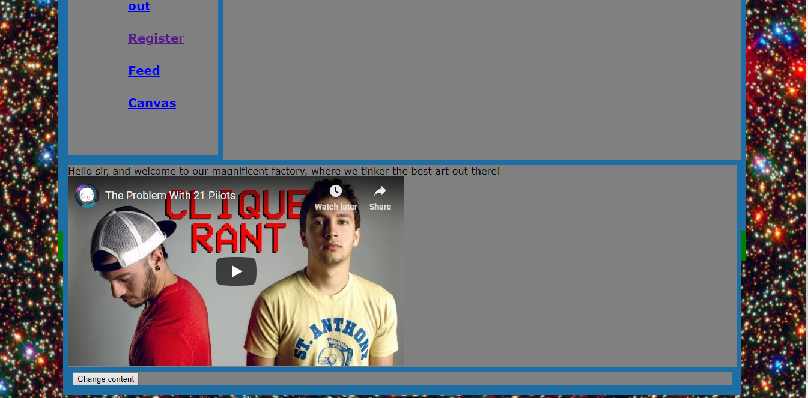
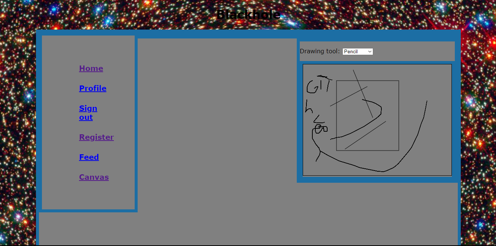
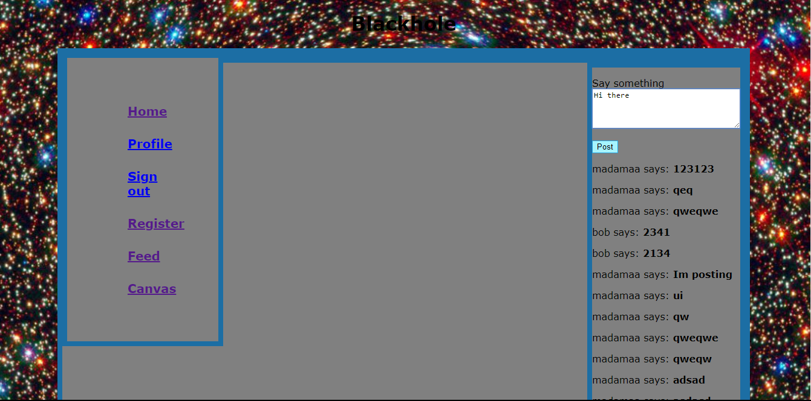

BLACKHOLE is a social network.

It is a web application created using Python Flask framework.

The main idea of the website is a social network where people are supposed to make images using given web tools and then discuss them, play games with them etc 

Also people are able to write there blog

